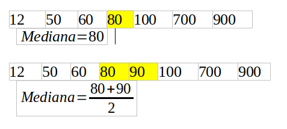

# adc-sampler
Implement the next Data logger for the adc using C to program the function to collet 500-1000 samples and computes the required data.


# Antes de iniciar

Para poder ejecutar el script es necesario tener instalado ´gcc´, para comprobarlo teclee el siguiente comando:
```
gcc -version
```
Si le aparece una versión instalada, ya está listo para iniciar, en caso contrario, se puede instalar `gcc` con el comando: 
```
sudo apt install GCC
```

# Muestreo con ADC0 en BeagleBone Black

El script fue creado para realizar de 500 a 1000 mediciones con el ADC0 de una BeagleBone Black y con ellas calcular:

*Promedio: Suma de todos los valores dividido entre el numero de mediciones. 


donde `Nmes` son la cantidad de mediciones y `xi` el valor medido. 

*Mediana: Valor que se encuentra en la posición central de los valores medidos. En caso de que el número de datos sea par, se calcula el promedio de los datos centrales, como se aprecia en la imagen. 



*Densidad de potencia.

*Mostrar histograma.

*RMS: Valor efectivo. 


donde `Nmes` son la cantidad de mediciones y `xi` el valor medido.

*Valor mínimo.

*Valor máximo.

# Antes de ejecutar el script

Para poder utilizar el script, es necesario primero compilarlo con `gcc`, el comando es:
```
gcc main.c -o archivo_salida -lm
```
Se le puede colocar el nombre que se desee en `archivo_salida`, solamente que se debe tener en cuenta que ese nombre es el que 
se escribirá a la hora de ejecutar el script. 

**IMPORTANTE** 

- Para compilar el archivo es necesario que se encuentre en la carpeta en la que se tiene almacenado.

- Ya no es necesario darle permisos de ejecución a `archivo_salida`, ya que tiene el permiso desde que se crea.

# Modo de uso

El pin que se usa como entrada es `AIN0`, que se puede observar en la parte izquierda de la imagen. 


El script desarrollado es muy sencillo de usar, ya que solamente recibe un parámetro, el cual es el número de mediciones que se desean
registrar, el comando es:
```
./archivo_salida x
```
En donde `x` es el número de mediciones, el cual puede ir de 500 a 1000.

# Nota

Cada línea `|` del histograma representa 20 unidades del valor medido, esto se realizó para que se pudiera visualizar bien en la
terminal, aun así, puede que no quepa en pantalla, por lo que puede que se necesite alejar la vista.
